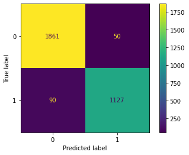
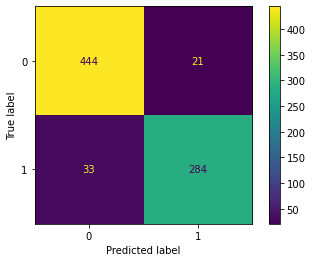

# Assignment

## Problem statement 
1. Perform Exploratory Data Analysis
1. Perform Data Preprocessing
1. Decide on Feature Selection
1. Model Training and Cross Validation
1. Model Evaluation
1. Test set predictions

## Files submitted
1. notebooks/notebook.ipynb -- contains the code to read the data, train-evaluate-save the model in the `results` directory
1. codes/predict.py -- can be used to score any new test datasets encountered
1. results/model.pkl -- serialized model that can be used to score/predict from the features
1. results/test_predictions.csv -- the predictions are available for the test set data using model.pkl

## Observations
1. The features cannot be understood as the column names are anonymized
1. There is a high degree of missing variables in the dataset as we dont know whether zero can be treated as missing or simply the value zero.
    1. The number of zero elements in both the dataset is ~75%; which is quite high
    1. Some variables also have a large number of zero
    1. Only a handful variables are not sparse
1. The dataset also suffers from heavy multi-collinearity, hence the choice of the model should be robust to multi-collinear features
1. Also the train and test data sets seems to have stark differences when it comes to a few variables obtained by predicted the data source (whether the data was from training or test datasets provided) from the available features

## Process
1. Import the datasets
1. Performed Exploratory Data Analysis
  1. Drift between training and test set
  1. Target's distribution
  1. Multi collinearity
  1. Sparcity
  1. Missing Info
1. Split the train dataset into training and validation datasets
1. Using the train datatset obtained above, perform KFold Cross Validation with accuracy as a metric
1. Build an objective function with the Random Forest Model, along with Accuracy as the metric to maximize and finally setup hyperopt framework for hyperparameter optimization of the RF model
1. Obtain the best hyperparameters using bayesian optimization over the hyper parameter search space using `hyperopt`
1. Perform RFE on RandomForestClassifier with the optimal hyper parameters applied
1. Rebuild the model using these hyperparameters on the training dataset with the feature identified through RFE
1. Evaluate the model performance on validation dataset using roc, accuracy, precision, recall, F1 Score & confusion matrix
1. Also obtain feature importance
1. Predict on the test dataset and export to a csv with the same index as the input test dataset file

## Key Takeaways
1. Optimal parameters of the Random Forest model were identified as 

1. Model achieved good average performance upon cross validation and RFE i.e. with just 15 features

------------ Training ------------

>                  precision    recall  f1-score   support
>    
>               0       0.95      0.97      0.96      1911
>               1       0.96      0.93      0.94      1217
>    
>        accuracy                           0.96      3128
>       macro avg       0.96      0.95      0.95      3128
>       weighted avg    0.96      0.96      0.96      3128

> ROC-AUC Score = 0.9499

------------ Validation ------------

>                precision    recall  f1-score   support
>    
>               0       0.93      0.95      0.94       465
>               1       0.93      0.90      0.91       317
>    
>        accuracy                           0.93       782
>       macro avg       0.93      0.93      0.93       782
>       weighted avg    0.93      0.93      0.93       782

> ROC-AUC Score = 0.9253

1. The most important features include
| index | col_nm | importance |
| ---- | ---- | ---- |
| 0 | X52 | 0.201811 |
| 1 | X7 | 0.122683 |
| 2 | X53 | 0.111047 |
| 3 | X56 | 0.094752 |
| 4 | X25 | 0.089620 |
| 5 | X21 | 0.084423 |
| 6 | X16 | 0.068855 |
| 7 | X55 | 0.058680 |
| 8 | X57 | 0.036003 |
| 9 | X5 | 0.027116 |
| 10 | X27 | 0.027044 |
| 11 | X19 | 0.022415 |
| 12 | X26 | 0.021299 |
| 13 | X46 | 0.019927 |
| 14 | X24 | 0.014324 |

1. Why did I select Random Forest?

Random Forest and other tree based ensemble models such as XGBoost are robust to Outliers, Sparsity, Non linear relationships, Missing values, Linear combination and multi-collinearity. Hence I chose Random Forest as it is simpler to implement and achieves decent performance when tuned properly. I could have selected XGBoost model as well but RF was giving a good performance so did not experiment with XGBoost but the entire process will be similar for XGBoost as well.

Also since the variables names were masked there was very little feature preprocessing I could do. Hence went ahead with Random Forest model.

2. Why I chose the RFE?

After finding the right set of hyper parameters, it would be wise to reduce the number of features to remove non-contributing variables. For the same, I used the Recursive Feature Elimination process to weed out the 2 variables having the least feature importance in each iteration.
